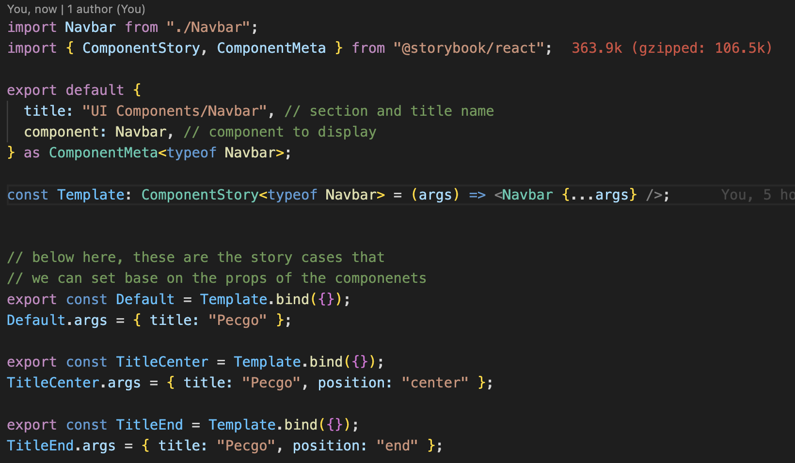
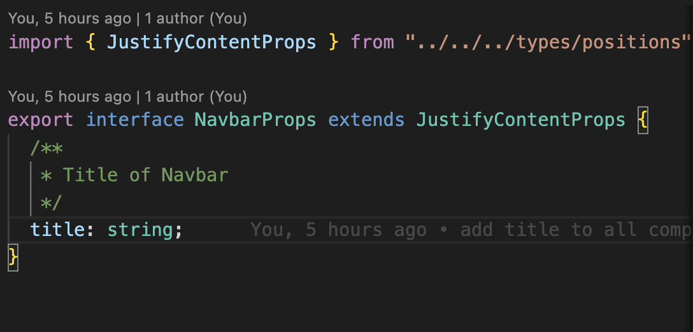

# learn-storybook

Big room / Tech share Pecogo

## Storybook

### What is Storybook ?

Storybook is workshop that help us to create UI componenets and document them to share across the team.

### Benifits and Drawbacks

- Benifits:
  1. Vritualize the UI components
  2. Document the component
  3. Easy to learn
- Drawback:
  1. Large size
  2. Not Fully support Node 18
  3. Some bugs on Markup and other features
  4. High learnig curve

### Why do we use it ?

As our project keep grow up, we need some tools to help us manage the componets to make it less and reusable, to prevent project from decreasing performance or build-time issues.

However, by using Storybook will help the new teammate to get familiar with the project faster.

### How to create storybook components ?

1. First you need to create your components and `stories` file with the same name ( the compoenets name must be the same name with stories ).

```
- components
    - nav
        - Navbar.stories.tsx
        - Navbar.tsx
```

2. Second In `stories.tsx` ( you can see from the `commends` )

   

This is how to provide the description for the props, by using `jsDOC`



### How to run this project ?

To run storybook

```
yarn storybook

or

npm run storybook
```

To run react

```
yarn dev

or

npm run dev
```
